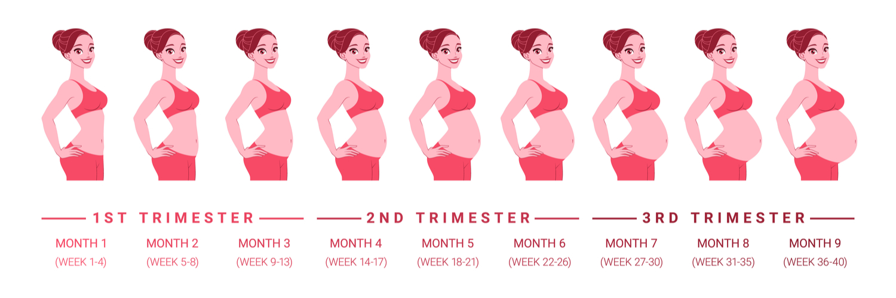
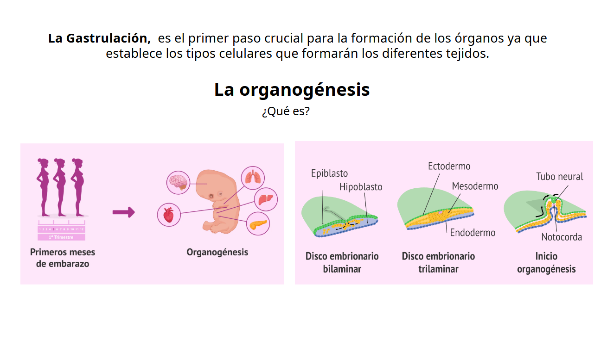
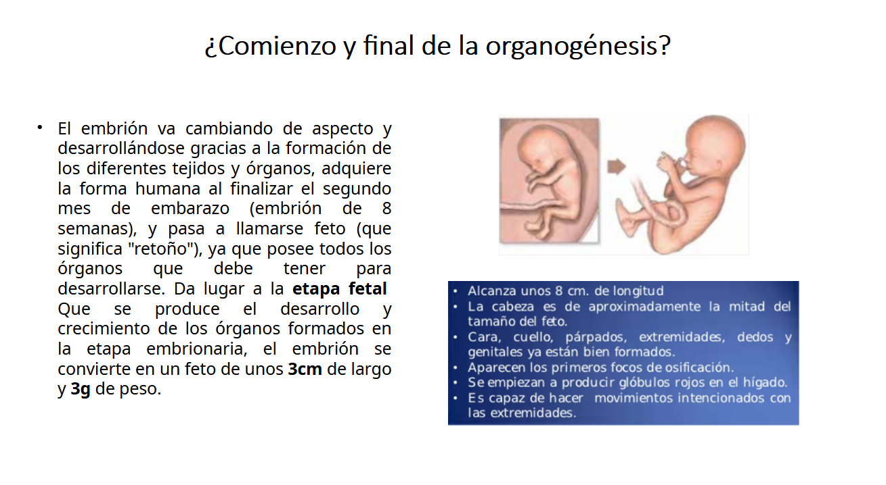
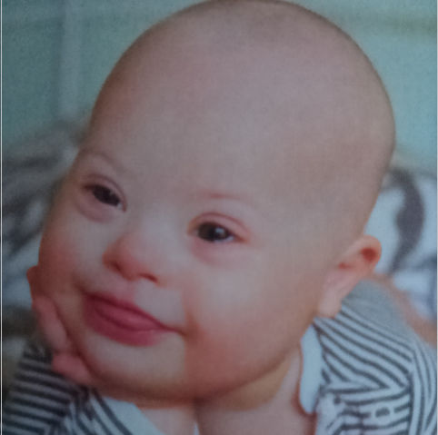
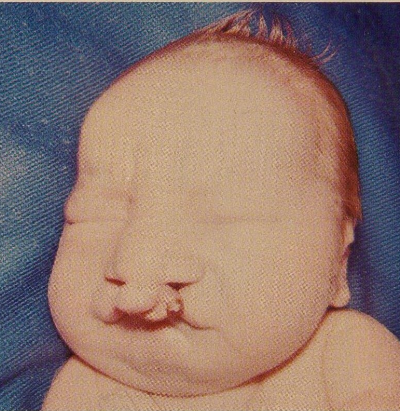
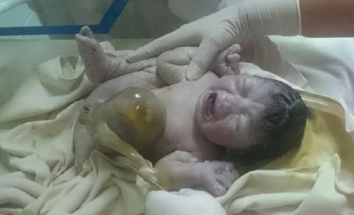

// Cosas de Mandinga

:author: Arguello Y., Barrionuevo J., Flores V.,  Kutschker W., Piazzi E.
:revealjs_theme: custom_white
:showtitle: false

pass:[<link rel="stylesheet" href="css/custom.css">]

:revealjsdir: .

//Portada

== I.E.F.I

++++

  

++++

[.text-center]

Estudiantes:

Arguello Yamila

Barrionuevo Julieta

Flores Virginia  

Kutschker Walter

Piazzi Eugenia

== PRIMER TRIMESTRE DE EMBARAZO

=== Temario

* Desarrollo embrionario
* Cambios fisiologicos y psicologicos
* Controles Prenatales
* Riesgos en el 1er trimestre
* Recomendaciones nutricionales

//YAMI

== Desarrollo embrionario

[%notitle]
=== - - - 

[%notitle]
=== - - - 

image::imagenes/yami/1.png[.fullsize]

[%notitle]
=== - - - 

[%notitle]
=== - - - 

image::imagenes/yami/3.png[.fullsize]

[%notitle]
=== - - - 

//JULI

== Cambios fisiológicos y psicológicos en el 1° trimestre del embarazo

=== Cambios fisiológicos principales 

* **Endocrinos:** ↑ hCG, progesterona, estrógenos, prolactina, relaxina.
* **Cardiovasculares:** ↑ gasto cardíaco, ↓ presión arterial, soplos funcionales.
* **Respiratorios:** ↑ ventilación minuto, alcalosis respiratoria leve.
* **Renales:** ↑ TFG y flujo renal, riesgo de ITU.

=== Cambios fisiológicos principales 

* **Gastrointestinales:** reflujo, estreñimiento, náuseas/vómitos.
* **Tegumentarios:** melasma, línea nigra, hiperpigmentación.
* **Hematológicos:** anemia fisiológica, hipercoagulabilidad.
* **Musculoesqueléticos:** lordosis, laxitud ligamentaria.

=== Síntomas frecuentes

* Náuseas y vómitos.
* Cansancio y fatiga.
* Disnea leve.
* Cambios cutáneos.
* Micción frecuente.
* Mareos o hipotensión.

=== Signos de alarma fisiológicos 

[.txt-right]
* Sangrado vaginal anormal.
* Dolor abdominal intenso.
* Cefalea intensa + visión borrosa.
* Edema súbito en cara y manos.

[.left-img]
* Fiebre > 38 °C.
* Pérdida de líquido por vagina.
* Vómitos persistentes (hiperémesis).
* Dolor torácico o disnea marcada.
* Convulsiones.

=== Acciones de enfermería sobre cambios fisiológicos 

* Fomentar controles prenatales tempranos.
* Educar sobre cambios normales vs patológicos.
* Enseñar reconocimiento de signos de alarma.
* Promover hábitos saludables: alimentación, hidratación, descanso.
* Manejo de síntomas: náuseas, reflujo, hipotensión, cambios cutáneos.

=== Cambios psicológicos

* Impacto emocional inicial (alegría, miedo, ambivalencia).
* Cambios en el estado de ánimo (oscilaciones, irritabilidad).
* Adaptación al nuevo rol de madre.
* Preocupaciones sobre salud, pareja, entorno y proyectos.
* Inicio del vínculo con el bebé (fantasías, expectativas, temores).

=== Signos de alarma psicológicos 

[.txt-right]
* Ansiedad intensa y persistente.
* Tristeza profunda y mantenida.
* Alteraciones graves de sueño y alimentación.
* Ideas negativas respecto al embarazo.

[.left-img]
* Ideación suicida o autolesiva.
* Conductas de riesgo (alcohol, drogas, abandono del cuidado).
* Síntomas psicóticos (delirios, alucinaciones).
* Relatos de violencia.

=== Acciones de enfermería sobre cambios psicológicos 

* Escucha activa y contención emocional.
* Educar sobre cambios emocionales normales.
* Promover redes de apoyo (pareja, familia, grupos).
* Detección temprana de problemas de salud mental.

=== Acciones de enfermería sobre cambios psicológicos 

* Derivación inmediata ante ideación suicida, violencia o psicosis.
* Promover autocuidado: sueño, alimentación, relajación.
* Activar protocolos frente a violencia de género.

//WALTER

== Recomendaciones nutricionales en el 1er trimetre

[[calorias_macros]]
=== 1. Calorías y macronutrientes

Las necesidades calóricas apenas aumentan (~100 kcal extra/día).

* Proteínas: 1,1 g/kg/día, esenciales para la formación de células y tejidos del bebé.
  ** Fuentes: carnes magras, pescado seguro, huevos, lácteos, legumbres

* Carbohidratos: principal fuente de energía; preferir complejos para mantener glucosa estable.
  ** Fuentes: cereales integrales, frutas, verduras

* Grasas: importantes para el desarrollo cerebral y ocular (DHA/omega-3).
  ** Fuentes: aceite de oliva, frutos secos, semillas, pescados grasos seguros

[[micronutrientes]]
=== 2. Micronutrientes clave

* *Ácido fólico* (B9): 400–800 mcg/día → previene defectos del tubo neural
  ** Fuentes: verduras de hoja, legumbres, cereales fortificados

* *Hierro:* necesidad aumenta por el incremento del volumen sanguíneo; previene anemia
  ** Fuentes: carne magra, porotos, espinaca; acompañar con vitamina C para mejorar absorción

* *Calcio:* para huesos y dientes del bebé; meta 1000 mg/día
  ** Fuentes: lácteos, leches vegetales fortificadas, verduras de hoja

[[micronutrientes2]]
=== 2. Micronutrientes clave

* *Yodo:* función tiroidea y desarrollo cerebral
  ** Fuentes: sal yodada, lácteos, pescado seguro

* *Vitamina D:* ayuda a absorber calcio; deficiencia frecuente
  ** Fuentes: sol, alimentos fortificados, suplementos si se requiere

* *Vitamina B12:* especialmente importante si se sigue dieta vegetariana/vegana
  ** Fuentes: carne, huevos, lácteos, alimentos fortificados

[[hidratacion]]
=== 3. Hidratación

* Beber ~2–2,5 L líquidos/día
* Agua e infusiones seguras; evitar exceso de cafeína o hierbas no recomendadas

[[alimentos_a_evitar]]
=== 4. Alimentos y sustancias a evitar

* Pescado con alto mercurio (atun, caballa, tiburón)
* Carnes, huevos o mariscos crudos o poco cocidos
* Lácteos o jugos sin pasteurizar
* Alcohol: abstenerse completamente durante todo el embarazo; no hay cantidad segura (recomendacion OMS)
* Cafeína >200 mg/día

[[consejos_nauseas]]
=== 5. Consejos para náuseas

* Comer poco y frecuentemente
* Snacks secos antes de levantarse
* Jengibre o comidas suaves ayudan a tolerar mejor los alimentos

//VIR

== Control Prenatal

seguimiento médico para un embarazo saludable

=== ¿Que es el control prenatal?

*conjunto de acciones médicas y asistenciales

*entrevistas programadas con el equipo de salud

*OBJETIVOS:*

*controlar la evolución del embarazo y preparar a la madre para el parto y la crianza

=== caracteristicas del control prenatal
:background-image: /imagenes/VIR1.png
:revealjs_background_opacity: 0.9

* *Precoz:* debe iniciarse en el primer trimestre
* *Periódico:* frecuencia segun tiempo gestacional, riesgos
* *Completo:* evaluacion general y específica
* *Amplia cobertura:* igualdad, accecibilidad, gratuidad

=== Actividades durante el control prenatal 

* Ácido fólico preconcepcional y el primer trimestre
* Historia clinica perinatal
* Evauacion de factores de riesgo
* Grupo sanguineo y factor
* Estado nutricional y presión arterial

=== Actividades durante el control prenatal 

* suplementacion con hierro
* diagnostico de infecciones (VDRL, chagas, VIH, HBV, Toxo, etc.)
* urocultivo y ecografias
* educacion sobre maternidad y anticoncepcion

=== Primera consulta 

* Confirmacion de embarazo (test de embarazo, analisis de sangre para detectar hormona gonadotropina coriónica hCG)

* Confeccion de historia clinica perinatal (dentificacion socio-cultural, antecedentes familiares, personales y obstétricos)

=== Primera consulta 

* Examen fisico y ginecologico
* Peso, talla, presion, pulso
* Altura uterina (se mide en centimetros), frecuencia cardiaca fetal (ecografia), movimientos fetales (leves)

=== Primera consulta 

* Prevencion del tétanos neonatal y puerperal
* Detección de tabaquismo, alcoholismo, dragsdicción y automedicacion
* Deteccion de enfermedades clinicas de la madre (epilepsia, cardiopatias, nefropatias,etc)
* Examen de mamas y preparacion para lactancia

=== Exámenes complementarios

* Coombs indirecta (anticuerpos)
* Hemograma, glucemia, urea
* Urocultivo (detectar bacterias, hongos etc, en la orina)
* Toxoplasmosis
* Ecografia (confirmar embarazo intrauterino, detectar n° de fetos, evaluar actividad cardiaca, estimar edad gestacional y FPP)
* Utiizar gestograma (FPP en base a la FUM)

=== Recomendaciones generales

* Iniciar el control lo antes posible
* Asistir a todas las consultas programadas
* Informar cualquier síntoma de alarma
* Seguir recomendaciones sobre alimentación, descanso y
hábitos.

//EUGE

== Riesgos en el 1er Trimestre de Embarazo

=== Introducción
- Objetivo de los controles prenatales: acompañar el desarrollo materno-fetal y asegurar una gestación saludable.
- Controles rutinarios: análisis de sangre, orina, presión arterial, ecografías.
- Estudios específicos: no reemplazan a los rutinarios, pero detectan precozmente riesgos o alteraciones fetales.
- Beneficio: decisiones médicas informadas y prevención de complicaciones.

=== Desarrollo 
- Importancia: cualquier alteración durante la *organogénesis* puede afectar el desarrollo posterior.
- Análisis bioquímicos maternos: beta-HCG libre y PAPP-A; combinados con ecografía = índice de riesgo.
- Diagnósticos invasivos:
  * Biopsia de vellosidades coriónicas: muestra de placenta para análisis genético.
  * Amniocentesis: extracción de líquido amniótico para estudio de cariotipo.
- Estudios específicos: ecografía de traslucencia nucal (11-14 semanas) mide líquido en la nuca del feto; aumento = riesgo cromosómico.

=== Ecografia de translucencia nucal

image::imagenes/ECONUCAL.png[Down, width=600, alt="Down"]

=== Amniocentesis

image::imagenes/AMNIOSCENTESIS.png[Down, width=600, alt="Down"]

=== Anolaías cromosómicas mas comunes

=== Síndrome de Down (trisomía 21)

[.left-img]

[.txt-right]
* Retraso intelectual 
* Cardiopatías congénitas.

=== Síndrome de Edwards (trisomía 18)

[.left-img]
image::imagenes/EDWARDS.png[Edwards, width=250, alt="Edwards"]

[.txt-right]
* Malformaciones múltiples
* Bajo peso
* Alta mortalidad

=== Síndrome de Patau (trisomía 13)

[.left-img]

[.txt-right]

* Malformaciones SNC.
* Cardiopatías. 
* Anomalías faciales.

=== Síndrome de Turner (monosomía X)

[.left-img]
image::imagenes/TURNER.png[Turner, width=250, alt="Turner"]

[.txt-right]
* Talla baja
* Alteraciones en el aparato genital.
* Posibles malformaciones cardíacas.

=== Malformaciones estructurales detectables precozmente

- Cardiopatías congénitas: sospecha en 1er trimestre, confirmación con ecocardiografía fetal.
- Defectos del tubo neural: ej. espina bífida (2do trimestre, ecografía y alfa-fetoproteína).
- Malformaciones abdominales: onfalocele, gastrosquisis.

=== Espina bifida

image::imagenes/BIFIDA.png[fit, height=500, align=center]

=== Gastrosquisis

image::imagenes/ABDOMINAL0.png[fit, height=500, align=center]

=== Onfalocele

=== Patologías maternas de riesgo en el primer trimestre

[.txt-right]
- Diabetes gestacional precoz: afecta crecimiento fetal y metabolismo.
- Hipertensión/preeclampsia temprana: detectables con marcadores bioquímicos y Doppler uterino.
- Infecciones maternas: toxoplasmosis, rubéola, citomegalovirus; graves secuelas fetales.

=== Conclusión

[.txt-right]
- Los controles de rutina aseguran seguimiento normal.
- Los estudios específicos permiten detectar anomalías y riesgos tempranamente.
- Ambos son complementarios: brindan seguridad, previenen complicaciones y protegen la salud materna y fetal.

== cierre

Nos despedimos con este video

https://www.youtube.com/watch?v=SLgqxChD3TQ

[style="display:flex; justify-content:center; align-items:center;"]
== ej 3d

++++

<model-viewer src="utero3.glb"
              alt="3D model"
              camera-controls
              auto-rotate
              min-camera-orbit="auto auto 0.5m"
              max-camera-orbit="auto auto 10m"
              style="display:block; margin:0 auto; width:900px; height:600px;">
</model-viewer>

++++
